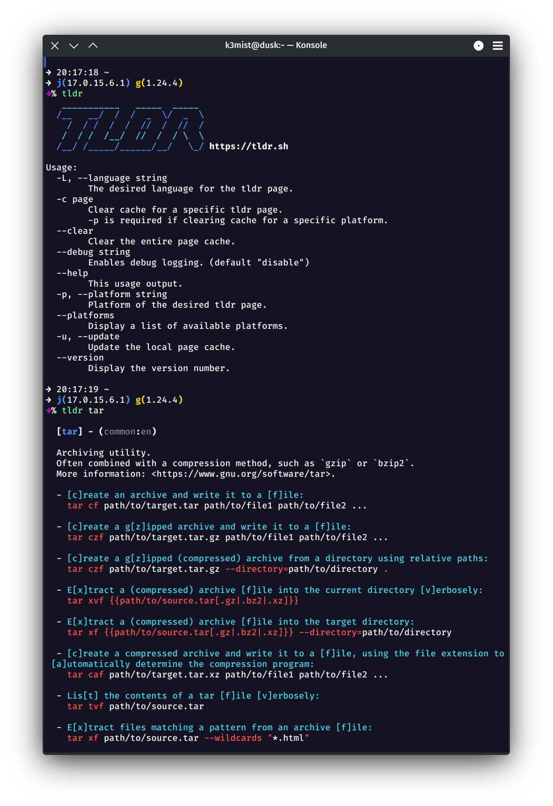

# tldr in golang

[TLDR pages](https://tldr-pages.github.io/) - Simplified and community-driven man pages



## Install

```
go get -u bitbucket.org/djr2/tldr
```

## Download

* [Distributions](https://bitbucket.org/djr2/tldr/src/master/dist/)

## Building and Build Requirements

* go
* upx -- https://github.com/upx/upx
* tar

```
bin/build
```

The build script will compile and compress all the binaries. Currently
just darwin, linux, and windows.

To a build a specific platform version run the below commands. Make
sure to replace `[platform]` with the desired operating system to build
the executable for.

Supported Go build platforms and architectures can be found here;
https://golang.org/doc/install/source#environment

It is not necessary to run upx but it greatly reduces executable size.

```bash
GOOS=[platform] GOARCH=amd64 go build -ldflags="-s -w" -o tldr
upx --brute tldr # executable compression
```

## Usage

```
Usage:
  -c page
      clear cache for a tldr page
      page -- Use `clearall` to clear entire cache
      -p is required if clearing cache for a specific platform
  -debug string
      enables debug logging (default "disable")
  -p platform
      platform of the tldr page
      platform -- common, linux, osx, sunos, windows (default "common")
```

### View a tldr
```
tldr <page>
```

### View a tldr for a specific platform
```
tldr -p osx <page>
```

### Clear a tldr
```
tldr -c <page>
```

### Clear a tldr for a specific platform
```
tldr -c <page> -p osx
```

### Clear entire cache
```
tldr -c clearall
```

## Configuration

A configuration is created the first time `tldr` is run.

The configuration is located at;
```
$HOME/.tldr/config.json
```

Pages repository URI, Zip URI, and all of the output colors are
configurable.

Below is the default configuration.

```
{
"pages_uri": "",
"zip_uri": "",
"banner_color_1": 36,
"banner_color_2": 34,
"tldr_color": 97,
"header_color": 34,
"header_decor_color": 97,
"platform_color": 90,
"description_color": 0,
"example_color": 36,
"hypen_color": 0,
"syntax_color": 31,
"variable_color": 0
}
```

If plain (default) terminal text is desired set all color options to `0`.

`pages_uri` and `zip_uri` when left blank will use the official TLDR
locations.

These can be used to test pages from a custom repository
or any zip collection that follows the official TLDR directory format
and file specification.

Pages: `https://raw.githubusercontent.com/tldr-pages/tldr/main/pages/`

Zip: `https://tldr-pages.github.io/assets/tldr.zip`

To reset the configuration back to its defaults delete `config.json`
and it will be recreated. Or copy and paste the configuration from
this README above.

## License

[MIT License](https://bitbucket.org/djr2/tldr/src/master/LICENSE.md)
